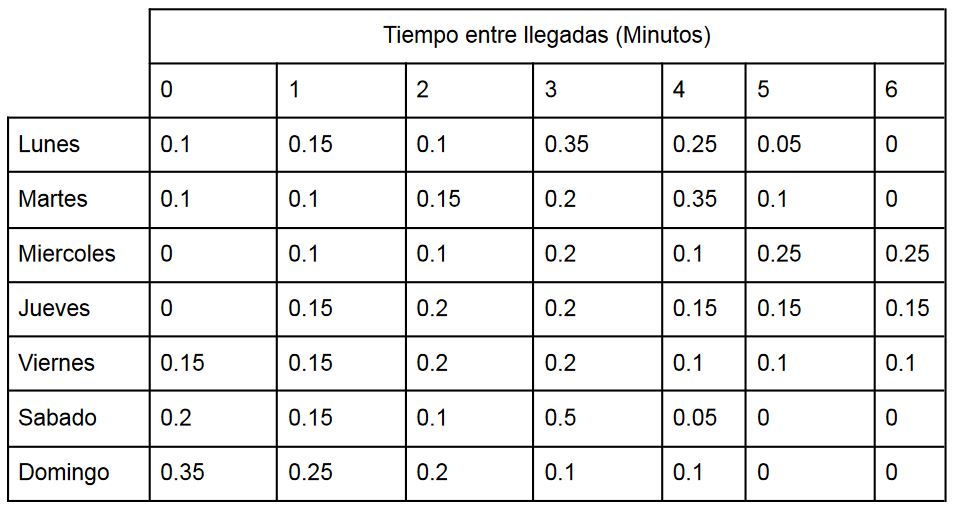

## Project 1 - Bank simulation

Link to hosted shiny app:  https://ofnj3w-franciscohernandez1998.shinyapps.io/project-1-shiny-app/

## Description
Based on a table that contains the probability distributions of time between arrivals of customers to a bank by day, the results for the next items were found:

- Display the average size of the customers queue by day of the week based on the number of servers available at the bank
- Display the average amount of time that a customer spends in queue before being attended by a bank server
- Display the average amount of unattended customers due to a maximum size of the waiting queue at the bank

The table mentioned before is the next:

There are n agents working at the bank. Each of the bank agents takes in average 8 minutes to serve a customer and has a deviation of 5 minutes

## Simulation

The results and form of the simulation that was used to complete the items listed previously can be seen on the file [**"simulation-example.xlsx"**](./simulation-example.xlsx). This simulation was performed with two agents and a queue size of five

## How to run

Just import the project into RStudio and run any file [ui | server].R
